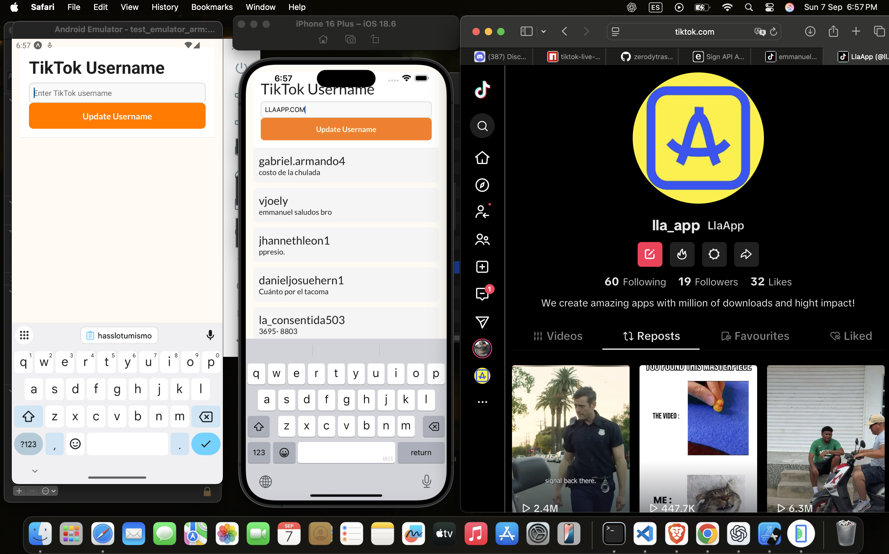
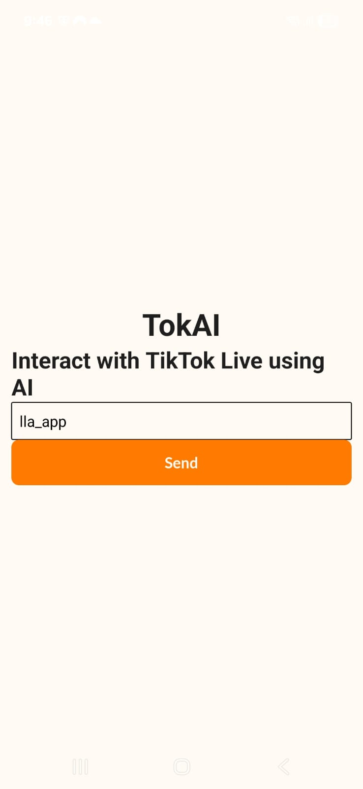
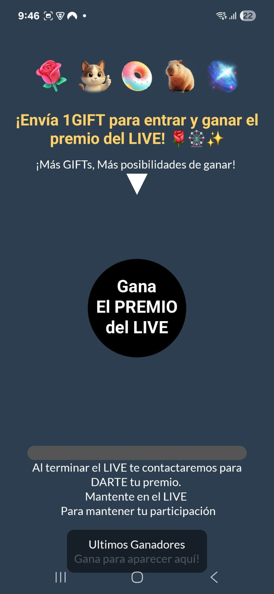
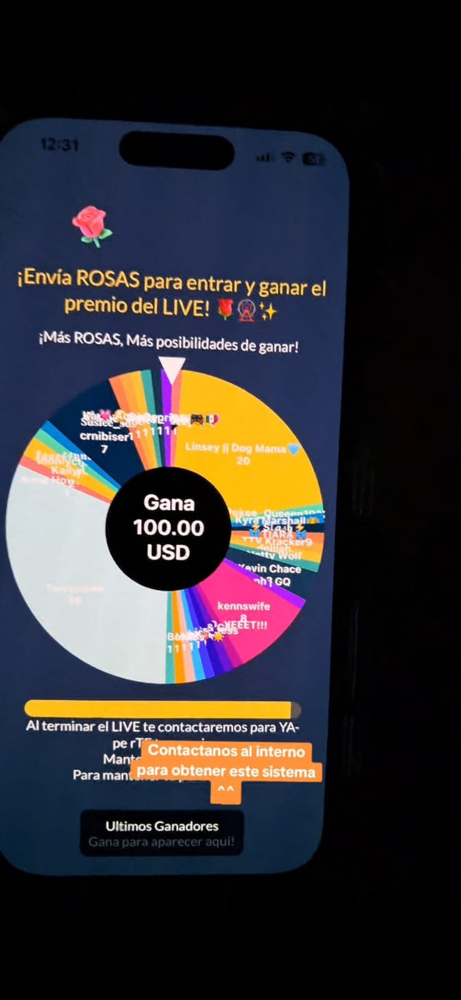

> 🔊 **Turning TikTok Comments into Voice with AI** 🔊  
>
> **TokAI** lets creators hear their TikTok Live audience in real time—right from their iPhone or Android.  
> - Transforms live chat comments into natural AI voices, so you never miss a word.  
> - Runs directly on your device—no extra setup or hardware.  
> - Built with React Native and advanced AI speech tech for lifelike voices.  
> - Designed to boost connection and engagement during live streams.  
>
> Live content is about conversation and connection—TokAI makes every comment count.  
>
> This is just the beginning for TokAI 🚀  
>
> _Would you try TokAI on your next TikTok Live?_  
>
> #TokAI #AI #ReactNative #MobileApps #TikTokLive

## ✨ Features & Preview

<a href="./resources/tokai_clip.mp4" title="Watch a demo of TokAI in action!">
  
</a>

<p align="center">
  
  
  
</p>


# TokAI App

created by Binni Cordova
[@binnicordova](https://github.com/BinniZenobioCordovaLeandro)

using my incredible TokAI  
[@tokai_binnicordova](https://github.com/BinniZenobioCordovaLeandro/tokai_binnicordova)

---

## 🚀 Getting Started

Clone the boilerplate and install dependencies:

```sh
pnpm install
```

Start the app:

```sh
pnpm start        # Production
pnpm dev          # Development
pnpm preview      # Preview
```

## 📚 Storybook & Testing

Run Storybook:

```sh
pnpm run storybook
```

Run tests:

```sh
pnpm run test
pnpm run test:coverage
```

## 🧹 Formatting & Linting

```sh
pnpm run format
npx lint-staged
```

## 📲 QR Preview

Generate QR for Expo Go:

```sh
pnpm run eas-preview
```

## 🔄 CI/CD & Deep Linking

Pushes to `main` trigger EAS builds.  
Deep linking supported via Expo Router:

```sh
npx uri-scheme open tokai.com://index --android
npx uri-scheme open tokai.com://index --ios
```

## 🏗️ Project Structure

Organized by feature/domain:

```text
src/
├── app/          # Screens
├── components/   # UI
├── hooks/        # Custom hooks
├── models/       # Types
├── services/     # API
├── tasks/        # Background
├── theme/        # Styles
└── utils/        # Helpers
```

## 🤝 How to Collaborate

We welcome contributions! To get started:

1. Fork the repository.
2. Create a new branch:  
  ```sh
  git checkout -b feature/your-feature
  ```
3. Make your changes and commit:
  ```sh
  git commit -m "Add your feature"
  ```
4. Push to your fork and open a pull request.

Please follow the [Contributing Guidelines](CONTRIBUTING.md) and ensure your code passes all tests.

## 💖 Support & Donations

If you find this project helpful, consider supporting its development:

- [Buy Me a Coffee](https://www.buymeacoffee.com/binnicordova)
- [GitHub Sponsors](https://github.com/sponsors/BinniZenobioCordovaLeandro)

Your support helps keep the project active and growing!

---

# By Binni Cordova

## 📬 Connect with Binni Cordova

PortFolio
- [binnicordova.com](https://binnicordova.com)

Contact him:
- [](https://www.linkedin.com/in/binni-cordova-a77000175/)
- [](https://calendly.com/binnizenobiocordovaleandro/meet)
- [](https://github.com/binnizenobiocordovaleandro)
- [](mailto:binnizenobiocordovaleandro@gmail.com)
- [](tel:+1-650-374-4225)
